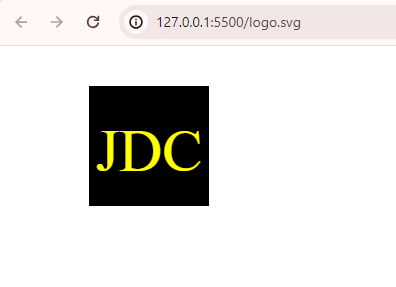
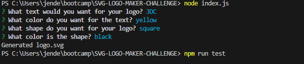

# SVG LOGO GENERATOR CHALLENGE    

## Table of Contents
- [Description](#description)
- [Installation](#installation)
- [Usage](#usage)
- [Contributors](#contributing)
- [Tests](#tests)
- [License](#license)
- [Questions](#questions)

## Description
This project is a command-line application that takes in user input to generate a logo and save it as an SVG file.

## Installation
To install this application, clone this repository to your local machine, navigate to the project directory: SVG LOGO MAKER CHALLENGE and install the dependencies.

## Usage
Once installed, you can run the generator by command node index.js to terminal. Follow the prompts and provide necessary details. After successfully answering the questions, a svg file will be generated and can be viewed in a live server.

## Contributing
Contributors are welcome! If you encountered issues or have any suggestions, open an issue to GitHub.

## Tests
A test file is attached inside the code.

## Questions
  My GitHub profile is: Jenina52112 [View on GitHub](https://github.com/Jenina52112)

  For additional questions, contact me at email address: jeninadelacruz521@yahoo.com
